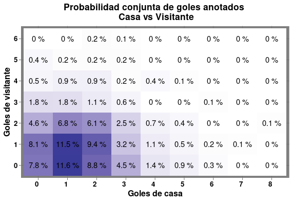

# Postwork Primera Etapa
A continuacion se muestra el procedimiento utilizado para cumplir con todos los puntos planteados dentro de los postworks de la 1ra a la 4ta sesión.

## Postwork sesion1
Importamos el data set de la liga de futbol española 2019-2020 usando la funcion read.csv() desde el URL.
```R
LigaEsp2019.2020 <- read.csv("https://www.football-data.co.uk/mmz4281/1920/SP1.csv")
```

Los goles anotados por los equipos que jugaron en casa (FTHG) y los visitantes (FTAG)
```R
goles.casa <- c(LigaEsp2019.2020$FTHG)
goles.visitante <- c(LigaEsp2019.2020$FTAG)
```

Tablas de frecuencia absoluta de goles de la casa, goles de visitantes y casa vs visitantes
```R
frec.goles.casa <- table(goles.casa)
frec.goles.visitante <- table(goles.visitante)
frec.goles <- table(goles.casa, goles.visitante)
```

Tablas de frecuencia relativa de goles de la casa y goles de visitantes
```R
frec.rel.goles.casa <- prop.table(x=frec.goles.casa)
frec.rel.goles.visitante <- prop.table(x=frec.goles.visitante)
```
```R
goles <- c(seq(0,6,1))
for (i in 1:length(frec.rel.goles.casa)) {
    print(
        paste(
            "La probabilidad marginal de que la casa anote",
            i,"goles es: ", frec.rel.goles.casa[i]
        )
    )
}
```
> La probabilidad marginal de que la casa anote 1 goles es:  0.231578947368421
> 
> La probabilidad marginal de que la casa anote 2 goles es:  0.347368421052632
> 
> La probabilidad marginal de que la casa anote 3 goles es:  0.260526315789474
> 
> La probabilidad marginal de que la casa anote 4 goles es:  0.1
> 
> La probabilidad marginal de que la casa anote 5 goles es:  0.0368421052631579
> 
> La probabilidad marginal de que la casa anote 6 goles es:  0.0210526315789474
> 
> La probabilidad marginal de que la casa anote 7 goles es:  0.00263157894736842

```R
for (i in 1:length(frec.rel.goles.visitante)) {
  print(paste("La probabilidad marginal de que el vistitante anote",i,"goles es: ", frec.rel.goles.visitante[i]))
}
```
> La probabilidad marginal de que el vistitante anote 1 goles es:  0.357894736842105
> 
> La probabilidad marginal de que el vistitante anote 2 goles es:  0.352631578947368
> 
> La probabilidad marginal de que el vistitante anote 3 goles es:  0.213157894736842
> 
> La probabilidad marginal de que el vistitante anote 4 goles es:  0.0473684210526316
> 
> La probabilidad marginal de que el vistitante anote 5 goles es:  0.0236842105263158
> 
> La probabilidad marginal de que el vistitante anote 6 goles es:  0.00526315789473684

Tabla de probabilidad conjunto de `x` goles del equipo de casa vs `y` goles del visitante
```R
print("La probabilidad conjunta de que el equipo de casa anote 'x' goles y el equivo visitante anote 'y' goles está representada en la tabla:")
(frec.rel.goles <- prop.table(frec.goles))
```
> La probabilidad conjunta de que el equipo de casa anote 'x' goles y el equivo visitante anote 'y' goles está representada en la tabla:


||goles.visitante|||||||
|-|-|-|-|-|-|-|-|
|goles.casa||||||||
|||0|1|2|3|4|5|
||0|0.086842105|0.073684211|0.039473684|0.021052632|0.005263158|0.005263158|
||1|0.113157895|0.128947368|0.084210526|0.013157895|0.007894737|0.000000000|
||2|0.102631579|0.092105263|0.052631579|0.007894737|0.005263158|0.000000000|
||3|0.036842105|0.036842105|0.018421053|0.005263158|0.002631579|0.000000000|
||4|0.010526316|0.013157895|0.010526316|0.000000000|0.002631579|0.000000000|
||5|0.005263158|0.007894737|0.007894737|0.000000000|0.000000000|0.000000000|
||6|0.002631579|0.000000000|0.000000000|0.000000000|0.000000000|0.000000000|


## Postwork sesion 2
Creamos una lista con las direcciones donde se encuentran los archivos de futbol de las temporadas 2017/2018, 2018/2019 y 2019/2020 de la primera división de la liga española
```R
library(dplyr)
l.URLs <- list("https://www.football-data.co.uk/mmz4281/1718/SP1.csv",
               "https://www.football-data.co.uk/mmz4281/1819/SP1.csv",
               "https://www.football-data.co.uk/mmz4281/1920/SP1.csv"
)
```

Leemos los archivos desde las URLs y los guardamos como elementos DataFrame en una lista
```R
lista_archivos <- lapply(l.URLs, read.csv)
length(lista_archivos)  #La lista contiene 3 elementos que son los 3 dataframes
```

El elemento 1 de la lista contiene el dataframe con los datos de la temporada 2017-2018
```R
str(data.frame(lista_archivos[1]))
head(data.frame(lista_archivos[1]))
View(data.frame(lista_archivos[1]))
summary(data.frame(lista_archivos[1]))
```
```
Div     Date   HomeTeam   AwayTeam FTHG FTAG FTR HTHG HTAG HTR HS AS HST AST HF AF HC AC
1 SP1 18/08/17    Leganes     Alaves    1    0   H    1    0   H 16  6   9   3 14 18  4  2
2 SP1 18/08/17   Valencia Las Palmas    1    0   H    1    0   H 22  5   6   4 25 13  5  2
3 SP1 19/08/17      Celta   Sociedad    2    3   A    1    1   D 16 13   5   6 12 11  5  4
4 SP1 19/08/17     Girona Ath Madrid    2    2   D    2    0   H 13  9   6   3 15 15  6  0
5 SP1 19/08/17    Sevilla    Espanol    1    1   D    1    1   D  9  9   4   6 14 12  7  3
6 SP1 20/08/17 Ath Bilbao     Getafe    0    0   D    0    0   D 12  8   2   2 16 15  7  6
  HY AY HR AR B365H B365D B365A  BWH  BWD  BWA  IWH IWD  IWA  LBH  LBD  LBA  PSH  PSD  PSA
1  0  1  0  0  2.05  3.20  4.10 2.05 3.10 4.10 2.10 3.4 3.50 2.05 3.00 4.20 2.03 3.25 4.52
2  3  3  0  1  1.75  3.80  4.50 1.75 3.90 4.60 1.75 3.6 4.80 1.75 3.80 4.33 1.78 4.01 4.83
3  3  1  0  0  2.38  3.25  3.20 2.40 3.30 3.00 2.50 3.3 2.85 2.35 3.25 3.00 2.44 3.40 3.16
4  2  4  0  1  8.00  4.33  1.45 7.50 4.33 1.45 7.20 4.4 1.45 7.50 4.00 1.50 8.36 4.38 1.49
5  2  4  1  0  1.62  4.00  5.50 1.62 3.90 5.75 1.55 4.0 6.20 1.60 3.90 5.50 1.62 4.17 6.18
6  1  3  0  1  1.50  4.00  7.50 1.48 4.25 7.00 1.50 4.2 6.50 1.50 4.00 7.00 1.53 4.37 7.31
   WHH  WHD  WHA  VCH VCD  VCA Bb1X2 BbMxH BbAvH BbMxD BbAvD BbMxA BbAvA BbOU BbMx.2.5
1 2.05 3.10 4.00 2.05 3.2 4.40    35  2.12  2.03  3.40  3.15  4.52  4.17   31     2.84
2 1.80 3.75 4.20 1.80 4.0 4.60    35  1.83  1.77  4.04  3.86  4.83  4.46   33     1.69
3 2.40 3.40 2.90 2.40 3.4 3.13    35  2.50  2.39  3.50  3.32  3.20  3.01   34     2.03
4 8.00 4.20 1.44 7.50 4.3 1.50    35  8.36  7.53  4.40  4.17  1.51  1.48   34     2.20
5 1.67 3.60 5.50 1.65 4.0 5.75    35  1.69  1.63  4.17  3.93  6.20  5.58   33     1.81
6 1.50 4.00 7.00 1.50 4.2 7.00    34  1.53  1.50  4.40  4.17  7.50  6.94   32     2.01
  BbAv.2.5 BbMx.2.5.1 BbAv.2.5.1 BbAH BbAHh BbMxAHH BbAvAHH BbMxAHA BbAvAHA PSCH PSCD PSCA
1     2.68       1.53       1.46   18 -0.50    2.07    2.03    1.90    1.86 1.98 3.35 4.63
2     1.64       2.40       2.27   16 -0.75    2.05    1.97    1.96    1.91 1.78 4.24 4.43
3     1.98       1.90       1.84   18 -0.25    2.08    2.05    1.87    1.83 2.12 3.53 3.74
4     2.11       1.80       1.74   16  1.25    1.77    1.75    2.25    2.16 6.93 3.83 1.63
5     1.75       2.14       2.09   16 -1.00    2.12    2.06    1.86    1.82 1.64 4.18 5.82
6     1.94       1.96       1.87   17 -1.00    1.90    1.86    2.05    2.01 1.53 4.48 6.91
```

El elemento 2 de la lista contiene el dataframe con los datos de la temporada 2018-2019
```R
str(data.frame(lista_archivos[2]))
head(data.frame(lista_archivos[2]))
View(data.frame(lista_archivos[2]))
summary(data.frame(lista_archivos[2]))
```
```
  Div       Date   HomeTeam   AwayTeam FTHG FTAG FTR HTHG HTAG HTR HS AS HST AST HF AF HC AC HY AY HR AR B365H B365D
1 SP1 17/08/2018      Betis    Levante    0    3   A    0    1   A 22  6   8   4 10 10  5  3  0  2  0  0  1.66  4.00
2 SP1 17/08/2018     Girona Valladolid    0    0   D    0    0   D 13  2   1   1 21 20  3  2  1  1  0  0  1.75  3.60
3 SP1 18/08/2018  Barcelona     Alaves    3    0   H    0    0   D 25  3   9   0  6 13  7  1  0  2  0  0  1.11 10.00
4 SP1 18/08/2018      Celta    Espanol    1    1   D    0    1   A 12 14   2   5 13 14  8  7  3  2  0  0  1.85  3.50
5 SP1 18/08/2018 Villarreal   Sociedad    1    2   A    1    1   D 16  8   7   4 16 10  4  6  2  3  0  0  2.04  3.40
6 SP1 19/08/2018      Eibar     Huesca    1    2   A    0    2   A 18  8   6   6 12 13  7  0  1  1  0  0  1.66  3.75
  B365A  BWH  BWD   BWA  IWH  IWD  IWA  PSH   PSD   PSA  WHH WHD   WHA  VCH  VCD  VCA Bb1X2 BbMxH BbAvH BbMxD BbAvD
1   5.0 1.70  3.7  5.25 1.75 3.60  4.9 1.69  4.19  5.11 1.67 3.9  4.75 1.67  4.2  5.2    40  1.75  1.68  4.25  4.00
2   5.0 1.75  3.5  5.25 1.80 3.60  4.5 1.80  3.70  4.99 1.75 3.6  4.60 1.80  3.7  4.8    40  1.85  1.78  3.83  3.60
3  21.0 1.11 10.0 20.00 1.12 9.00 20.0 1.11 11.27 25.40 1.08 9.0 29.00 1.10 10.5 34.0    40  1.13  1.10 11.50  9.82
4   4.5 1.91  3.4  4.25 1.90 3.50  4.1 1.93  3.64  4.27 1.91 3.5  4.00 1.93  3.5  4.4    38  1.97  1.90  3.73  3.53
5   3.8 2.05  3.3  3.90 2.00 3.40  3.8 2.06  3.51  3.91 2.05 3.3  3.60 2.05  3.5  3.9    40  2.11  2.03  3.62  3.43
6   5.5 1.70  3.7  5.25 1.70 3.75  5.0 1.72  3.90  5.26 1.73 3.6  4.75 1.70  3.8  5.0    40  1.76  1.70  3.93  3.77
  BbMxA BbAvA BbOU BbMx.2.5 BbAv.2.5 BbMx.2.5.1 BbAv.2.5.1 BbAH BbAHh BbMxAHH BbAvAHH BbMxAHA BbAvAHA PSCH  PSCD  PSCA
1  5.25  4.95   38     1.82     1.76       2.15       2.06   20 -0.75    1.89    1.85    2.07    2.00 1.59  4.42  5.89
2  5.27  4.79   38     2.21     2.13       1.78       1.71   20 -0.75    2.06    2.01    1.90    1.85 1.76  3.57  5.62
3 41.00 25.67   32     1.39     1.34       3.40       3.18   19 -2.50    1.95    1.91    2.00    1.95 1.10 11.85 32.17
4  4.50  4.20   36     2.13     2.06       1.84       1.76   18 -0.75    2.26    2.18    1.74    1.71 2.18  3.26  3.85
5  3.93  3.76   37     2.05     1.99       1.88       1.81   18 -0.25    1.76    1.74    2.23    2.14 2.32  3.21  3.53
6  5.50  5.08   37     1.95     1.88       1.98       1.91   19 -0.75    1.96    1.91    2.01    1.94 1.77  3.68  5.32
```

El elemento 3 de la lista contiene el dataframe con los datos de la temporada 2019-2020
```R
str(data.frame(lista_archivos[3]))
head(data.frame(lista_archivos[3]))
View(data.frame(lista_archivos[3]))
summary(data.frame(lista_archivos[3]))
```
```
  Div       Date  Time   HomeTeam    AwayTeam FTHG FTAG FTR HTHG HTAG HTR HS AS HST AST HF AF HC AC HY AY HR AR B365H
1 SP1 16/08/2019 20:00 Ath Bilbao   Barcelona    1    0   H    0    0   D 11 11   5   2 14  9  3  8  1  1  0  0  5.25
2 SP1 17/08/2019 16:00      Celta Real Madrid    1    3   A    0    1   A  7 17   4  11 17 12  6  4  5  2  0  1  4.75
3 SP1 17/08/2019 18:00   Valencia    Sociedad    1    1   D    0    0   D 14 12   6   3 13 14  3  3  4  4  1  0  1.66
4 SP1 17/08/2019 19:00   Mallorca       Eibar    2    1   H    1    0   H 16 11   4   5 13 14  9  3  2  3  0  0  2.80
5 SP1 17/08/2019 20:00    Leganes     Osasuna    0    1   A    0    0   D 13  4   2   2 17 11  8  0  1  4  1  0  2.00
6 SP1 17/08/2019 20:00 Villarreal     Granada    4    4   D    1    1   D 12 14   7   7 10 16  2  7  3  1  0  0  1.60
  B365D B365A  BWH  BWD  BWA  IWH  IWD  IWA  PSH  PSD  PSA  WHH WHD  WHA  VCH  VCD  VCA MaxH MaxD MaxA AvgH AvgD AvgA
1  3.80  1.65 5.50 3.80 1.65 5.00 3.80 1.70 5.15 3.84 1.74 5.00 3.8 1.70 5.00 3.80 1.75 5.50 3.95 1.76 5.07 3.81 1.71
2  4.20  1.65 4.40 4.20 1.72 5.30 4.20 1.60 4.73 4.18 1.72 5.25 4.2 1.60 4.75 4.20 1.73 5.30 4.40 1.73 4.67 4.12 1.69
3  3.75  5.50 1.67 3.75 5.50 1.67 3.75 5.30 1.68 3.94 5.47 1.67 3.8 5.25 1.67 3.90 5.75 1.72 3.98 5.75 1.68 3.80 5.29
4  3.20  2.60 2.95 3.10 2.60 2.90 3.10 2.60 2.98 3.14 2.66 2.90 3.1 2.62 2.90 3.13 2.70 3.05 3.20 2.70 2.91 3.09 2.62
5  3.20  4.20 2.05 3.25 3.90 2.05 3.10 4.05 2.10 3.21 4.13 2.05 3.2 4.00 2.10 3.20 4.10 2.10 3.30 4.25 2.06 3.18 4.02
6  3.80  6.50 1.60 3.80 6.25 1.63 4.00 5.50 1.62 3.99 6.13 1.60 3.9 5.80 1.65 4.00 5.75 1.65 4.15 6.50 1.61 3.95 5.80
  B365.2.5 B365.2.5.1 P.2.5 P.2.5.1 Max.2.5 Max.2.5.1 Avg.2.5 Avg.2.5.1   AHh B365AHH B365AHA PAHH PAHA MaxAHH MaxAHA
1     1.80       2.00  1.81    2.09    1.85      2.11    1.79      2.05  0.75    1.99    1.94 1.98 1.94   2.00   1.95
2     1.53       2.50  1.52    2.66    1.53      2.72    1.49      2.58  0.75    2.04    1.89 2.01 1.91   2.05   1.91
3     2.00       1.80  2.08    1.82    2.14      1.83    2.07      1.77 -0.75    1.91    2.02 1.91 2.01   1.93   2.03
4     2.30       1.61  2.45    1.60    2.47      1.65    2.34      1.60  0.00    2.05    1.88 2.07 1.85   2.07   1.88
5     2.50       1.53  2.72    1.50    2.75      1.54    2.59      1.49 -0.50    2.08    1.85 2.10 1.82   2.10   1.85
6     1.80       2.00  1.88    2.02    1.90      2.05    1.84      1.98 -1.00    2.05    1.75 2.11 1.81   2.14   1.85
  AvgAHH AvgAHA B365CH B365CD B365CA BWCH BWCD BWCA IWCH IWCD IWCA PSCH PSCD PSCA WHCH WHCD WHCA VCCH VCCD VCCA MaxCH
1   1.96   1.92   5.25   3.80   1.65 4.75 3.75 1.75 5.00 3.80 1.70 5.34 3.62 1.78 5.00  3.8 1.70 4.80 3.80 1.80  5.80
2   2.00   1.88   5.25   4.20   1.57 4.50 4.10 1.70 4.60 3.80 1.75 5.10 4.46 1.65 5.00  4.2 1.63 5.20 4.40 1.65  6.00
3   1.89   1.99   1.66   3.75   5.50 1.65 3.80 5.50 1.67 3.80 5.30 1.69 3.88 5.47 1.65  3.9 5.25 1.70 3.90 5.50  1.72
4   2.04   1.85   2.87   3.20   2.55 2.95 3.10 2.60 2.90 3.10 2.60 2.96 3.26 2.60 2.90  3.1 2.60 3.00 3.13 2.63  3.05
5   2.06   1.83   1.90   3.10   5.00 1.95 3.20 4.50 1.90 3.15 4.85 1.90 3.18 5.30 2.05  3.2 4.00 1.90 3.20 5.20  1.95
6   2.07   1.80   1.53   4.00   6.50 1.57 3.80 6.50 1.55 4.05 6.30 1.54 4.19 6.87 1.62  3.9 5.80 1.57 4.00 7.00  1.58
  MaxCD MaxCA AvgCH AvgCD AvgCA B365C.2.5 B365C.2.5.1 PC.2.5 PC.2.5.1 MaxC.2.5 MaxC.2.5.1 AvgC.2.5 AvgC.2.5.1  AHCh
1  3.90  1.81  5.03  3.66  1.76      1.90        1.90   1.98     1.93     1.99       2.11     1.86       1.97  0.75
2  4.52  1.75  4.93  4.26  1.65      1.44        2.75   1.49     2.76     1.51       2.88     1.47       2.63  1.00
3  3.95  6.20  1.68  3.82  5.37      2.00        1.80   2.06     1.85     2.08       1.98     2.00       1.82 -0.75
4  3.29  2.72  2.93  3.14  2.59      2.20        1.66   2.20     1.74     2.38       1.74     2.24       1.66  0.00
5  3.26  5.30  1.90  3.16  4.91      2.75        1.44   2.84     1.47     2.85       1.50     2.69       1.46 -0.50
6  4.20  7.30  1.54  4.05  6.66      1.90        1.90   1.95     1.95     1.98       2.10     1.90       1.92 -1.00
  B365CAHH B365CAHA PCAHH PCAHA MaxCAHH MaxCAHA AvgCAHH AvgCAHA
1     1.93     2.00  1.91  2.01    2.02    2.03    1.91    1.98
2     1.82     1.97  1.85  2.07    2.00    2.20    1.82    2.06
3     1.94     1.99  1.92  2.00    1.96    2.12    1.89    2.00
4     2.11     1.82  2.09  1.83    2.12    1.88    2.07    1.83
5     1.89     2.04  1.90  2.01    1.95    2.06    1.90    1.99
6     1.96     1.97  1.96  1.96    1.98    2.12    1.93    1.95
```

Creo una lista con las columnas seleccionadas de cada dataframe
```R
lista_columnas <- lapply(lista_archivos, select, c("Date", "HomeTeam", "AwayTeam", "FTHG", "FTAG", "FTR"))
length(lista_columnas) #La lista contiene 3 elementos que son un dataframe de las columnas seleccionadas por cada temporada
str(data.frame(lista_columnas[1]))
str(data.frame(lista_columnas[2]))
str(data.frame(lista_columnas[3]))
```
```
> [1] 3

> 'data.frame':	380 obs. of  6 variables:
 $ Date    : chr  "18/08/17" "18/08/17" "19/08/17" "19/08/17" ...
 $ HomeTeam: chr  "Leganes" "Valencia" "Celta" "Girona" ...
 $ AwayTeam: chr  "Alaves" "Las Palmas" "Sociedad" "Ath Madrid" ...
 $ FTHG    : int  1 1 2 2 1 0 2 0 1 0 ...
 $ FTAG    : int  0 0 3 2 1 0 0 3 0 1 ...
 $ FTR     : chr  "H" "H" "A" "D" ...

> 'data.frame':	380 obs. of  6 variables:
 $ Date    : chr  "17/08/2018" "17/08/2018" "18/08/2018" "18/08/2018" ...
 $ HomeTeam: chr  "Betis" "Girona" "Barcelona" "Celta" ...
 $ AwayTeam: chr  "Levante" "Valladolid" "Alaves" "Espanol" ...
 $ FTHG    : int  0 0 3 1 1 1 2 1 2 1 ...
 $ FTAG    : int  3 0 0 1 2 2 0 4 1 1 ...
 $ FTR     : chr  "A" "D" "H" "D" ...
```

La columa "Date" de los dataframes es de clase caracter. Debemos de cambiarla a clase Date
El formato es diferente para cada dataframe
```R
tmp2017.2018.dfcols <- mutate(data.frame(lista_columnas[1]), Date = as.Date(Date, "%d/%m/%y"))
tmp2018.2019.dfcols <- mutate(data.frame(lista_columnas[2]), Date = as.Date(Date, "%d/%m/%Y"))
tmp2019.2020.dfcols <- mutate(data.frame(lista_columnas[3]), Date = as.Date(Date, "%d/%m/%Y"))
```
Ahora comprobamos que la columna "Date" sea clase Date.
```R
class(tmp2017.2018.dfcols$Date)
class(tmp2018.2019.dfcols$Date)
class(tmp2019.2020.dfcols$Date)
```

Por ultimo unimos todos los dataframes en uno solo
```R
lista_final <- list(tmp2017.2018.dfcols,tmp2018.2019.dfcols,tmp2019.2020.dfcols)
df.todo.final <- do.call(rbind, lista_final)
str(df.todo.final)
```
```
'data.frame':	1140 obs. of  6 variables:
 $ Date    : Date, format: "2017-08-18" "2017-08-18" "2017-08-19" "2017-08-19" ...
 $ HomeTeam: chr  "Leganes" "Valencia" "Celta" "Girona" ...
 $ AwayTeam: chr  "Alaves" "Las Palmas" "Sociedad" "Ath Madrid" ...
 $ FTHG    : int  1 1 2 2 1 0 2 0 1 0 ...
 $ FTAG    : int  0 0 3 2 1 0 0 3 0 1 ...
 $ FTR     : chr  "H" "H" "A" "D" ...
```

Guardamos el dataframe final para usarlo en la sesion 3
```R
write.csv(df.todo.final, file = "Fut.ligaEsp.Postwork2.csv", sep = ",", col.names=TRUE, row.names = FALSE)
```
## Postwork sesion 3
```R
library(dplyr)
library(ggplot2)
```

Importar y leer el archivo resultado del postwork 2; datos de la liga española de futbol
```R
Fut.ligaEsp <- read.csv("https://raw.githubusercontent.com/AngelicaDC/Postworks_BEDU/main/data/Fut.ligaEsp.Postwork2.csv")
str(Fut.ligaEsp)
```
```
'data.frame':	1140 obs. of  6 variables:
 $ Date    : chr  "2017-08-18" "2017-08-18" "2017-08-19" "2017-08-19" ...
 $ HomeTeam: chr  "Leganes" "Valencia" "Celta" "Girona" ...
 $ AwayTeam: chr  "Alaves" "Las Palmas" "Sociedad" "Ath Madrid" ...
 $ FTHG    : int  1 1 2 2 1 0 2 0 1 0 ...
 $ FTAG    : int  0 0 3 2 1 0 0 3 0 1 ...
 $ FTR     : chr  "H" "H" "A" "D" ...
```

Goles anotados por los equipos que jugaron en casa (FTHG) y los visitantes (FTAG)

Encontrar la probabilidad marginal de que la casa anote `x` goles a partir de las frec. relativas
```R
Frec.abs.FTHG <- table(Fut.ligaEsp$FTHG) #Frecuencias absolutas
pmarg.golesCasa <- prop.table(Frec.abs.FTHG) #Probabilidades marginales
```

Encontrar la probabilidad marginal de que el visitante anote `y` goles a partir de las frec. relativas
```R
Frec.abs.FTAG <- table(Fut.ligaEsp$FTAG) #Frecuencias absolutas
pmarg.golesVisitante <- prop.table(Frec.abs.FTAG) #Probabilidades marginales
```

Encontrar probabilidad conjunta de que la casa anote `x` goles y el visitante `y` goles
```R
Frec.abs.ambos <- table(Fut.ligaEsp$FTHG, Fut.ligaEsp$FTAG)
prob.conjunta <- prop.table(Frec.abs.ambos) #Probabilidades conjunta
```

Crear dataframes de probablidades para poder usar ggplot
```R
#Casa
df.goles.casa <- data.frame(pmarg.golesCasa)
equipo <- rep(x = "casa", 9)
df.goles.casa <- cbind(df.goles.casa, equipo)
#Visita
df.goles.visitante <- data.frame(pmarg.golesVisitante)
equipo <- rep(x = "visitante", 7)
df.goles.visitante <- cbind(df.goles.visitante, equipo)
#Conjunta
df.prob.conjunta <- data.frame(prob.conjunta)
df.prob.conjunta <- rename(df.prob.conjunta, Goles_casa=Var1, Goles_visitante=Var2)
```

Unir dataframes para hacer un grafico de barras que represente a ambos equipos
```R
df.goles.ambos <- rbind(df.goles.casa, df.goles.visitante)
sort(df.goles.ambos$Freq)
```

Graficar las probabilidades marginales de cada equipo
```R
df.goles.ambos %>%
  ggplot() + 
  aes(x=Var1, y=Freq, fill = equipo) +
  geom_bar(stat="identity", position="dodge", color= "black") +
  ggtitle("Probabilidad de anotar goles") +
  ylab("Probabilidad marginal") +
  xlab("Numero de goles") +
  facet_wrap("equipo") +
  scale_fill_manual(name="Equipo", values=c("#0a7c93","#43cc68")) +
  theme(plot.background = element_rect (fill = 'linen'),
        panel.background = element_rect (fill = 'tan'), 
        panel.grid.minor = element_line(linetype = "dotted"),
        axis.text.x = element_text(face = "bold", color="black" , size = 10, hjust = 1), 
        axis.text.y = element_text(face = "bold", color="black" , size = 10, hjust = 1),
        legend.background = element_rect (fill = 'linen'),
        plot.title =element_text(face = "bold", color="black"))
```
<p align="center"></p>


Graficar la probabilidad conjunta
```R
df.prob.conjunta %>%
  ggplot() + 
  aes(x = Goles_casa, y = Goles_visitante, fill = Freq) + 
  geom_tile()+
  ggtitle("Probabilidad conjunta de goles anotados \n Casa vs Visitante") +
  scale_fill_gradient(low = "white", high = "green4", name="Probabilidad \n conjunta") +
  xlab("Goles de casa") +
  ylab("Goles de visitante") +
  theme_dark() +
  theme(plot.title =element_text(face = "bold", color="black", hjust = 0.5),
        axis.text.x = element_text(face = "bold", color="black" , size = 10, hjust = 1), 
        axis.text.y = element_text(face = "bold", color="black" , size = 10, hjust = 1),
        axis.title.x = element_text(face = "bold", color="black" , size = 12, hjust = 0.5),
        axis.title.y = element_text(face = "bold", color="black" , size = 12, hjust = 0.5),
        legend.title = element_text(face = "bold", color="black" , size = 10, hjust = 0.5)) +
  scale_fill_gradient2(guide = FALSE) +
  geom_text(aes(label = paste(round(Freq*100,1), "%")))
```
<p align="center"></p>


### Postwork 4
Importar y leer el archivo resultado del postwork 2; datos de la liga española de futbol
```R
Fut.ligaEsp <- read.csv("https://raw.githubusercontent.com/AngelicaDC/Postworks_BEDU/main/data/Fut.ligaEsp.Postwork2.csv")
View(Fut.ligaEsp)
dim(Fut.ligaEsp)
```
```
> [1] 1140    6
```

Encontrar la probabilidad marginal de que la casa anote `x` goles a partir de las frec. relativas
```R
Frec.abs.FTH <- table(Fut.ligaEsp$FTHG) #Frecuencias absolutas
(pmarg.golesCasa <- c(prop.table(Frec.abs.FTHG))) #Probabilidades marginales
```
```
          0           1           2           3           4           5           6           7           8 
0.232456140 0.327192982 0.266666667 0.112280702 0.035087719 0.019298246 0.005263158 0.000877193 0.000877193 
```

Encontrar la probabilidad marginal de que el visitante anote `y` goles a partir de las frec. relativas
```R
Frec.abs.FTAG <- table(Fut.ligaEsp$FTAG) #Frecuencias absolutas
(pmarg.golesVisitante <- c(prop.table(Frec.abs.FTAG))) #Probabilidades marginales
```
```
          0           1           2           3           4           5           6 
0.351754386 0.340350877 0.212280702 0.054385965 0.028947368 0.009649123 0.002631579 
```

Encontrar probabilidad conjunta de que la casa anote `x` goles y el visitante `y` goles
```R
Frec.abs.ambos <- table(Fut.ligaEsp$FTHG, Fut.ligaEsp$FTAG)
(prob.conjunta <- prop.table(Frec.abs.ambos)) #Probabilidades conjunta
```
```
  
              0           1           2           3           4           5           6
  0 0.078070175 0.080701754 0.045614035 0.018421053 0.005263158 0.004385965 0.000000000
  1 0.115789474 0.114912281 0.068421053 0.017543860 0.008771930 0.001754386 0.000000000
  2 0.087719298 0.093859649 0.061403509 0.011403509 0.008771930 0.001754386 0.001754386
  3 0.044736842 0.032456140 0.024561404 0.006140351 0.001754386 0.001754386 0.000877193
  4 0.014035088 0.010526316 0.007017544 0.000000000 0.003508772 0.000000000 0.000000000
  5 0.008771930 0.005263158 0.004385965 0.000000000 0.000877193 0.000000000 0.000000000
  6 0.002631579 0.001754386 0.000000000 0.000877193 0.000000000 0.000000000 0.000000000
  7 0.000000000 0.000877193 0.000000000 0.000000000 0.000000000 0.000000000 0.000000000
  8 0.000000000 0.000000000 0.000877193 0.000000000 0.000000000 0.000000000 0.000000000
```

#### Obter una tabla de cocientes
Dividimos las probabilidades conjuntas por el producto de las probabilidades marginales correspondientes.
Calculamos el producto de probabilidades marginales
```R
produto.pmarginales <- pmarg.golesCasa%*%t(pmarg.golesVisitante)
produto.pmarginales
```
```
                 0            1            2            3            4            5            6
 [1,] 0.0817674669 0.0791166513 0.0493459526 1.264235e-02 6.728994e-03 2.242998e-03 6.117267e-04
 [2,] 0.1150915666 0.1113604186 0.0694567559 1.779471e-02 9.471376e-03 3.157125e-03 8.610342e-04
 [3,] 0.0938011696 0.0907602339 0.0566081871 1.450292e-02 7.719298e-03 2.573099e-03 7.017544e-04
 [4,] 0.0394952293 0.0382148353 0.0238350262 6.106494e-03 3.250231e-03 1.083410e-03 2.954755e-04
 [5,] 0.0123422592 0.0119421360 0.0074484457 1.908279e-03 1.015697e-03 3.385657e-04 9.233610e-05
 [6,] 0.0067882425 0.0065681748 0.0040966451 1.049554e-03 5.586334e-04 1.862111e-04 5.078486e-05
 [7,] 0.0018513389 0.0017913204 0.0011172669 2.862419e-04 1.523546e-04 5.078486e-05 1.385042e-05
 [8,] 0.0003085565 0.0002985534 0.0001862111 4.770699e-05 2.539243e-05 8.464143e-06 2.308403e-06
 [9,] 0.0003085565 0.0002985534 0.0001862111 4.770699e-05 2.539243e-05 8.464143e-06 2.308403e-06
```

Calculamos el cociente de la probabilidad conjunta sobre el producto de probabilidades marginales
```R
(cociente <- prob.conjunta/produto.pmarginales)
dim(cociente)
```
```
>   
            0         1         2         3         4         5         6
  0 0.9547829 1.0200350 0.9243724 1.4570907 0.7821612 1.9554031 0.0000000
  1 1.0060639 1.0318952 0.9850885 0.9859033 0.9261516 0.5556910 0.0000000
  2 0.9351621 1.0341495 1.0847107 0.7862903 1.1363636 0.6818182 2.5000000
  3 1.1327151 0.8493073 1.0304752 1.0055444 0.5397727 1.6193182 2.9687500
  4 1.1371571 0.8814433 0.9421488 0.0000000 3.4545455 0.0000000 0.0000000
  5 1.2922240 0.8013121 1.0706236 0.0000000 1.5702479 0.0000000 0.0000000
  6 1.4214464 0.9793814 0.0000000 3.0645161 0.0000000 0.0000000 0.0000000
  7 0.0000000 2.9381443 0.0000000 0.0000000 0.0000000 0.0000000 0.0000000
  8 0.0000000 0.0000000 4.7107438 0.0000000 0.0000000 0.0000000 0.0000000

> [1] 9 7
```

#### Hacemos un bootstrap para generar datos 
Usamos replace para que se permitan valores repetidos
```R
set.seed(52)
(bootstrap <- replicate(n=10, sample(cociente, replace = TRUE)))
dim(bootstrap)
```
```
           [,1]      [,2]      [,3]      [,4]      [,5]      [,6]      [,7]      [,8]      [,9]     [,10]
 [1,] 0.0000000 0.0000000 1.0706236 0.0000000 0.0000000 0.0000000 1.0304752 0.7862903 0.0000000 0.9547829
 [2,] 0.0000000 0.7862903 0.8814433 1.0847107 0.8814433 0.9547829 1.2922240 1.1327151 0.0000000 0.0000000
 [3,] 0.0000000 0.0000000 0.0000000 2.9381443 0.0000000 1.0341495 0.5397727 0.0000000 1.0055444 0.0000000
 [4,] 0.9243724 4.7107438 3.4545455 0.0000000 0.0000000 3.4545455 0.7821612 0.9547829 0.8493073 0.9793814
 [5,] 1.0706236 0.0000000 0.0000000 1.0060639 1.0706236 0.0000000 0.0000000 0.0000000 0.0000000 1.0847107
 [6,] 0.0000000 0.8013121 0.9547829 0.9793814 0.9261516 0.0000000 0.7821612 0.0000000 0.0000000 1.0304752
 [7,] 1.1371571 0.0000000 1.0055444 1.6193182 0.0000000 4.7107438 3.0645161 0.0000000 0.0000000 2.5000000
 [8,] 0.8814433 1.2922240 0.9793814 3.0645161 1.1371571 0.0000000 0.9850885 1.0706236 0.0000000 0.8013121
 [9,] 0.0000000 2.9687500 4.7107438 0.0000000 0.0000000 3.0645161 0.0000000 0.0000000 1.0200350 3.0645161
[10,] 1.4570907 0.9859033 0.0000000 1.5702479 1.1327151 1.4214464 0.9850885 0.0000000 2.9381443 0.0000000
[11,] 0.9351621 1.0060639 0.9850885 1.2922240 1.4570907 0.0000000 0.9850885 0.0000000 0.9243724 3.4545455
[12,] 2.9381443 0.8493073 1.1327151 0.5556910 0.0000000 0.0000000 0.0000000 0.0000000 0.0000000 0.0000000
[13,] 0.0000000 1.4570907 0.0000000 3.4545455 0.7821612 0.0000000 0.9351621 2.5000000 0.0000000 0.0000000
[14,] 0.0000000 0.5556910 1.5702479 1.5702479 0.8013121 0.0000000 0.0000000 0.5556910 0.7821612 0.0000000
[15,] 2.5000000 0.0000000 0.0000000 0.8493073 1.0304752 0.8814433 1.6193182 0.0000000 0.0000000 2.9381443
[16,] 0.7862903 0.9351621 0.0000000 0.0000000 1.9554031 0.7821612 0.7862903 0.9243724 1.1371571 1.1327151
[17,] 0.0000000 0.0000000 0.0000000 0.0000000 0.5556910 0.0000000 0.0000000 3.0645161 0.0000000 0.0000000
[18,] 0.0000000 0.8493073 1.1371571 1.0060639 0.7821612 1.0847107 0.0000000 0.0000000 3.0645161 0.0000000
[19,] 0.0000000 1.4570907 0.0000000 0.0000000 1.0847107 0.0000000 1.0847107 0.9850885 0.9421488 0.0000000
[20,] 0.7862903 0.0000000 1.0318952 0.0000000 3.0645161 0.9793814 1.0847107 0.8013121 1.1327151 0.0000000
[21,] 0.0000000 0.8814433 0.0000000 0.0000000 0.0000000 0.7862903 0.9421488 2.9687500 0.0000000 0.9859033
[22,] 1.4570907 0.0000000 0.5556910 0.0000000 0.9421488 2.5000000 1.1327151 0.9261516 0.7862903 1.4214464
[23,] 0.0000000 3.4545455 0.0000000 0.0000000 1.1371571 0.7862903 0.0000000 0.0000000 0.9261516 0.0000000
[24,] 0.9859033 0.0000000 0.0000000 0.0000000 0.0000000 1.0304752 1.1363636 0.8814433 0.9850885 1.1363636
[25,] 0.8814433 0.0000000 0.7862903 1.0200350 1.5702479 1.0060639 0.9261516 1.1327151 0.7862903 0.0000000
[26,] 0.0000000 3.0645161 1.5702479 0.8493073 0.0000000 0.0000000 0.0000000 0.9850885 0.9850885 1.0318952
[27,] 0.0000000 0.0000000 1.0706236 0.0000000 1.4214464 0.9421488 1.4214464 0.0000000 0.0000000 0.0000000
[28,] 0.0000000 2.9381443 0.9261516 0.0000000 0.0000000 0.0000000 0.0000000 1.0304752 1.6193182 0.0000000
[29,] 0.0000000 1.1371571 0.0000000 0.0000000 1.0706236 0.0000000 1.4570907 1.2922240 0.9547829 0.8814433
[30,] 0.0000000 1.4570907 0.8493073 3.0645161 1.2922240 0.9793814 0.0000000 0.0000000 3.0645161 0.9261516
[31,] 1.1327151 2.5000000 1.0055444 0.0000000 0.0000000 0.9859033 1.0318952 2.9687500 1.0318952 0.0000000
[32,] 0.7821612 0.7821612 0.0000000 0.0000000 1.6193182 0.0000000 0.9351621 0.0000000 4.7107438 4.7107438
[33,] 1.1363636 0.0000000 0.0000000 1.0318952 0.0000000 1.1363636 1.0847107 0.0000000 1.0060639 0.8013121
[34,] 3.0645161 0.0000000 0.0000000 1.1363636 0.0000000 0.0000000 0.0000000 1.0847107 0.9243724 0.0000000
[35,] 0.9421488 0.0000000 0.0000000 0.0000000 3.4545455 0.0000000 1.0060639 0.0000000 0.9859033 0.0000000
[36,] 0.9547829 0.0000000 0.0000000 0.7821612 1.0341495 2.9381443 0.0000000 0.0000000 1.9554031 0.0000000
[37,] 0.8013121 1.1363636 4.7107438 2.9687500 1.1363636 0.9261516 0.9547829 1.4214464 0.9261516 0.0000000
[38,] 1.0341495 0.7862903 3.4545455 0.8814433 1.6193182 0.9261516 0.7862903 0.9850885 1.0055444 0.0000000
[39,] 1.9554031 1.0060639 0.8814433 0.9850885 0.0000000 0.0000000 0.0000000 0.0000000 0.0000000 0.9850885
[40,] 1.6193182 1.0055444 0.0000000 0.0000000 0.9351621 0.0000000 0.9859033 1.0318952 0.0000000 0.0000000
[41,] 0.0000000 0.0000000 1.1363636 0.8493073 0.0000000 2.9687500 0.0000000 1.1363636 0.0000000 0.9243724
[42,] 0.0000000 0.6818182 0.7862903 0.0000000 0.0000000 0.9850885 0.5397727 0.8493073 0.9261516 1.0706236
[43,] 1.2922240 0.0000000 1.5702479 1.0055444 0.0000000 0.0000000 0.5397727 0.7821612 0.9850885 0.9793814
[44,] 1.0847107 0.5397727 1.0060639 3.0645161 0.7862903 0.0000000 3.4545455 1.9554031 0.0000000 3.0645161
[45,] 0.0000000 1.0060639 3.0645161 1.0706236 0.9351621 0.9261516 1.1363636 1.6193182 2.9381443 0.9351621
[46,] 0.9850885 0.0000000 1.6193182 0.7862903 0.9351621 0.0000000 0.0000000 0.8013121 0.0000000 0.9793814
[47,] 0.9243724 1.5702479 0.7821612 1.1371571 0.8814433 1.0341495 0.0000000 0.0000000 0.0000000 0.0000000
[48,] 0.0000000 1.0304752 0.9261516 0.8814433 1.1371571 0.0000000 1.9554031 0.0000000 0.0000000 0.0000000
[49,] 1.0304752 1.0706236 1.0847107 0.0000000 0.0000000 4.7107438 0.7821612 0.7821612 3.0645161 1.1327151
[50,] 1.4570907 0.0000000 0.0000000 0.0000000 0.0000000 1.2922240 0.0000000 0.7821612 3.4545455 0.8013121
[51,] 0.0000000 1.5702479 0.0000000 0.0000000 0.0000000 1.0706236 0.5556910 0.0000000 0.0000000 1.9554031
[52,] 1.0060639 0.0000000 0.9421488 0.9850885 0.9351621 0.0000000 0.0000000 0.0000000 1.2922240 0.0000000
[53,] 1.1363636 4.7107438 1.9554031 2.9381443 1.9554031 0.0000000 1.5702479 0.0000000 0.0000000 1.4214464
[54,] 0.0000000 0.0000000 1.0060639 0.9261516 0.0000000 1.1371571 1.5702479 0.0000000 3.0645161 0.0000000
[55,] 0.0000000 0.0000000 1.0318952 0.0000000 0.5556910 1.2922240 0.0000000 0.0000000 0.9547829 0.0000000
[56,] 0.0000000 0.0000000 0.0000000 0.0000000 0.0000000 0.0000000 0.9421488 0.0000000 2.9687500 1.1327151
[57,] 0.0000000 0.0000000 0.9547829 0.9243724 1.6193182 1.0060639 0.0000000 1.0200350 1.0060639 0.0000000
[58,] 2.9687500 0.9421488 3.4545455 0.0000000 0.0000000 0.0000000 1.0318952 1.5702479 0.9421488 1.9554031
[59,] 0.9793814 1.9554031 1.0847107 0.0000000 0.8814433 2.5000000 0.0000000 3.4545455 1.0200350 1.0200350
[60,] 0.0000000 1.0847107 0.0000000 1.4214464 0.9859033 1.5702479 0.0000000 0.0000000 0.0000000 0.0000000
[61,] 0.0000000 0.0000000 1.0341495 0.8493073 0.8814433 0.8013121 0.9261516 0.9793814 1.1363636 3.4545455
[62,] 0.0000000 0.0000000 0.0000000 0.0000000 0.0000000 0.0000000 1.0055444 0.9243724 1.4570907 1.0060639
[63,] 0.5556910 1.5702479 0.0000000 0.9859033 1.0055444 1.0304752 1.0847107 1.0341495 0.7862903 0.8814433
```
```
> [1] 63 10
```

#### Sacamos la media y la varianza para cada uno de los 63 cocientes
```R
(medias <- apply(bootstrap, MARGIN = 1, FUN = mean))
```
```
[1] 0.3842172 0.7013610 0.5517611 1.6109840 0.4232022 0.5474264 1.4037280 1.0211746 1.4828561 1.0490636 1.1039636 0.5475858
[13] 0.9128959 0.5835351 0.9818688 0.8439552 0.3620207 0.7923916 0.5553749 0.8880821 0.6564536 0.9721534 0.6304144 0.6155638
[25] 0.8109238 0.8486144 0.4855665 0.6514089 0.6793322 1.1633187 1.0656703 1.3540290 0.6196709 0.6209963 0.6388661 0.7664641
[37] 1.4982066 1.1478822 0.5813087 0.5577823 0.7015157 0.5839052 0.7154420 1.4955819 1.3631506 0.6106553 0.6329531 0.5930630
[49] 1.3658107 0.7787333 0.5151966 0.5160687 1.5687752 0.7704137 0.3834593 0.5043614 0.6530636 1.2865139 1.2895554 0.5062308
[61] 1.0062654 0.4393071 0.8934456
```
```R
(varianzas <- apply(bootstrap, MARGIN = 1, FUN = var))
```
```
 [1] 0.2513054 0.2549066 0.8844698 2.6849492 0.2989145 0.2275060 2.5615868 0.7134575 3.2043279 0.8291219 0.9134934 0.8830388
[13] 1.4955013 0.3775208 1.1582626 0.3171602 0.9321624 0.8808224 0.3611043 0.8053723 0.8621120 0.5442545 1.1920885 0.2860759
[25] 0.2329543 0.9313782 0.4130167 0.9923537 0.3673276 1.2867375 1.0114142 3.4187267 0.2931550 0.9841421 1.1915777 1.0193859
[37] 1.8256371 0.8113255 0.4638121 0.3814934 0.8945184 0.1845271 0.3178651 1.6967469 0.9023203 0.3286291 0.3405729 0.4773409
[49] 2.0910316 1.2129402 0.5655591 0.3057011 2.1819950 1.0094015 0.2760714 0.9378178 0.3542384 1.4806174 1.1524027 0.4524549
[61] 0.9029202 0.3412171 0.1642536
```

Y los convertimos a formato matriz
```R
(medias <- matrix(medias, nrow = 9, ncol = 7))
(varianzas <- matrix(varianzas, nrow = 9, ncol = 7))
```
```
           [,1]      [,2]      [,3]      [,4]      [,5]      [,6]      [,7]
 [1,] 0.2513054 0.8291219 0.3611043 0.9923537 1.8256371 0.3286291 0.2760714
 [2,] 0.2549066 0.9134934 0.8053723 0.3673276 0.8113255 0.3405729 0.9378178
 [3,] 0.8844698 0.8830388 0.8621120 1.2867375 0.4638121 0.4773409 0.3542384
 [4,] 2.6849492 1.4955013 0.5442545 1.0114142 0.3814934 2.0910316 1.4806174
 [5,] 0.2989145 0.3775208 1.1920885 3.4187267 0.8945184 1.2129402 1.1524027
 [6,] 0.2275060 1.1582626 0.2860759 0.2931550 0.1845271 0.5655591 0.4524549
 [7,] 2.5615868 0.3171602 0.2329543 0.9841421 0.3178651 0.3057011 0.9029202
 [8,] 0.7134575 0.9321624 0.9313782 1.1915777 1.6967469 2.1819950 0.3412171
 [9,] 3.2043279 0.8808224 0.4130167 1.0193859 0.9023203 1.0094015 0.1642536
```

#### Calculo estadistico de prueba para una muestra grande.
> H0: Mu=1
> 
> Ha: Mu!=1

Calculamos el estadistico de prueba para los valores de los cocientes
Usamos la varianza obtenida a partir de bootstrap
```R
(z0 <- (cociente-1)/sqrt(varianzas/63))
```
```
               0            1            2            3            4            5            6
  0  -0.71593327   0.17464281  -0.99892863   3.64199544  -1.27967066  13.22829601 -15.10634984
  1   0.09533093   0.26487612  -0.13188420  -0.18461228  -0.65074948  -6.04296936  -8.19617151
  2  -0.54721468   0.28844601   0.72414731  -1.49537284   1.58927054  -3.65536969  20.00385573
  3   0.64286907  -0.97806780   0.32788075   0.04375793  -5.91424201   3.39941199  12.84219992
  4   1.99120085  -1.53153155  -0.42056072  -4.29277460  20.59902727  -7.20693470  -7.39380741
  5   4.86283646  -1.46533928   1.04804375 -14.65958349  10.53668289 -10.55434447 -11.80001621
  6   2.09005668  -0.29059573 -16.44503857  16.51808293 -14.07825501 -14.35561394  -8.35305988
  7  -9.39693468  15.93347851  -8.22445715  -7.27125033  -6.09342883  -5.37332854 -13.58797911
  8  -4.43406239  -8.45719037  45.82974403  -7.86141947  -8.35583590  -7.90020408 -19.58451420
```

Y para comparar, calculamos tambien el estadistico de prueba es uno para cada uno de los 63 cocientes del bootstrap.

```R
(z0b <- (medias-1)/sqrt(varianzas/63))
```

#### Encontrar region de rechazo para dos colas porque la hipotesis alternativa es `Mu!=1`
Queremos que `alfa=0.1`. Dividimos `alfa/2=0.05`. Sacamos `z05` para ambas colas

```R
(z.05.arriba <- qnorm(p = 0.05, lower.tail = FALSE)) #z0 tiene que ser mas alta que z.05.arriba 
# --> [1] 1.644854

(z.05.abajo <- qnorm(p = 0.05, lower.tail = TRUE)) #z0 tiene que ser mas baja que z.05.abajo
# --> [1] -1.644854
```

#### Comprobar o rechazar hipotesis nula de que los valores de los cocientes son iguales a `1`
Region de rechazo de hipotesis nula `Z0 > z.05.arriba` o `Z0 < z.05.abajo`
```R
(rechazo.cociente <- (z0 > z.05.arriba) | (z0 < z.05.abajo)) #Los valores de la primer tabal cocientes tiene que ser mas baja que z.05.abajo 
```
||0|1|2|3|4|5|6|
|-|-|-|-|-|-|-|-|
|0|FALSE|FALSE|FALSE|TRUE|FALSE|TRUE|TRUE|
|1|FALSE|FALSE|FALSE|FALSE|FALSE|TRUE|TRUE|
|2|FALSE|FALSE|FALSE|FALSE|FALSE|TRUE|TRUE|
|3|FALSE|FALSE|FALSE|FALSE |TRUE|TRUE|TRUE|
|4|TRUE|FALSE|FALSE |TRUE |TRUE|TRUE|TRUE|
|5|TRUE|FALSE|FALSE |TRUE |TRUE|TRUE|TRUE|
|6|TRUE|FALSE |TRUE |TRUE |TRUE|TRUE|TRUE|
|7|TRUE| TRUE |TRUE |TRUE |TRUE|TRUE|TRUE|
|8|TRUE| TRUE |TRUE |TRUE |TRUE|TRUE|TRUE|


O mas grandes que `z.05.arriba`

```R
(rechazo.samples <- (z0b > z.05.arriba) | (z0b < z.05.abajo)) #Comparamos con las medias del bootstrap
```
||[,1]|[,2]|[,3]|[,4]|[,5]|[,6]|[,7]|
|-|-|-|-|-|-|-|-|
|[1,]|  TRUE| FALSE|  TRUE|  TRUE|  TRUE|  TRUE|  TRUE|
|[2,]|  TRUE| FALSE| FALSE|  TRUE| FALSE|  TRUE|  TRUE|
|[3,]|  TRUE|  TRUE|  TRUE| FALSE|  TRUE|  TRUE|  TRUE|
|[4,]|  TRUE| FALSE| FALSE| FALSE|  TRUE|  TRUE|  TRUE|
|[5,]|  TRUE|  TRUE|  TRUE| FALSE|  TRUE| FALSE|  TRUE|
|[6,]|  TRUE| FALSE|  TRUE|  TRUE|  TRUE|  TRUE|  TRUE|
|[7,]|  TRUE|  TRUE|  TRUE|  TRUE|  TRUE|  TRUE| FALSE|
|[8,]| FALSE|  TRUE| FALSE|  TRUE|  TRUE|  TRUE|  TRUE|
|[9,]|  TRUE|  TRUE|  TRUE|  TRUE|  TRUE|  TRUE|  TRUE|


### Los valores `TRUE` nos indican en que casos se rechaza la hipotesis nula, es decir que existe una dependencia entre las variables `x` y `y`
### Los valores `FALSE` nos indican en que casos que no se rechaza `H0`, es decir que las variables `x` y `y` son independientes.

> _NOTA_: El código fuente que se muestra en este documento se encuentra [aquí](postWorks_1eraEtapa.R).


<p align="center"></p>
